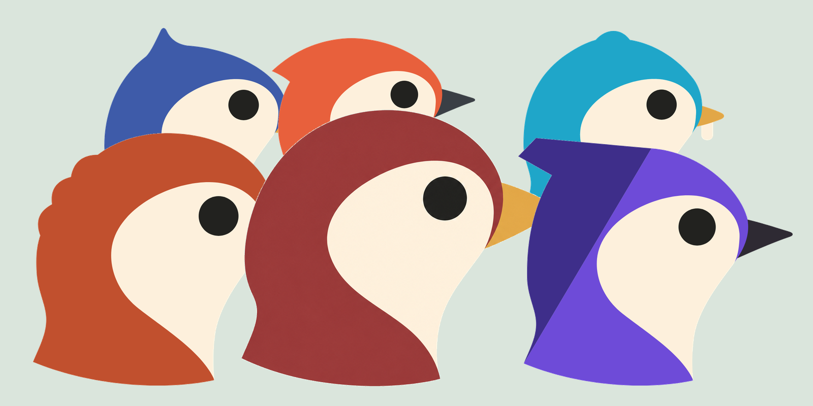

<h1>Hi, I'm Coden 👋</h1>

🔍 I like digging deep and sharing what I learn &nbsp;·&nbsp; 🤖 These days I build together with AI

 

## 👀 About Me

- 🧩 I build **iOS apps** and enjoy going deep on modularization and architecture
- 🛠️ When I need a tool, I **build it myself** — from developer CLIs to full products
- 🤖 I prototype fast **with AI** and turn ideas into shipped software
- ✍️ I like to **write down and share** what I learn along the way

 

## 🧰 Tech Stack

**Language & IDE**

**UI**

**Concurrency**

**Architecture**

**Web Bridge**

**Collaboration**

 

## 🚀 Projects & Products

> Things I designed, built, and shipped on my own.

### 🛠️ Developer Tools (Open Source)

> Static analysis tools that turn codebases — and database schemas — into a **queryable dependency graph** — dead code, cycles, impact analysis, layering rules, and architecture metrics as queries over one graph.

| Tool | Platform | Description |
| :--- | :--- | :--- |
| [**cartograph**](https://github.com/ictechgy/cartograph) |  | Queryable dependency graph for Swift / iOS codebases, built on IndexStoreDB |
| [**kartograph**](https://github.com/ictechgy/kartograph) |  | Explainable dependency graphs and dead-code analysis for Kotlin / Android |
| [**gartograph**](https://github.com/ictechgy/gartograph) |  | Queryable dependency graph for Go codebases — cycles, dead code, and layer rules as queries |
| [**rustograph**](https://github.com/ictechgy/rustograph) |  | Queryable dependency graph for Rust / Cargo workspaces — cycles, dead code, and impact analysis as queries |
| [**schemagraph**](https://github.com/ictechgy/schemagraph) |  | Dependency graphs for databases — catalogs and SQL bodies in, impact analysis, cycle detection, and architecture rules out |

<b>Dart / Flutter & cross-language graphs</b> &nbsp;·&nbsp; dartograph + isthmus — the Dart/Flutter engine and the joiner that links graphs across language boundaries, click to expand

 

| Tool | Platform | Description |
| :--- | :--- | :--- |
| [**dartograph**](https://github.com/ictechgy/dartograph) |  | Evidence-backed dependency graph analysis for Dart / Flutter codebases |
| [**isthmus**](https://github.com/ictechgy/isthmus) |  | Joins the graphs above across language boundaries — Flutter `MethodChannel`/Pigeon (Dart ↔ Swift/Kotlin) and React Native bridge calls that per-language tools miss, plus a `persistence` domain joining Go code to DB schemas via gartograph + schemagraph facts |

<b>More tools</b> &nbsp;·&nbsp; 12 more — for AI coding agents, iOS engineering, and data tooling, click to expand

 

**🤖 For AI coding agents** — deterministic, local, no LLM in the loop

| Tool | Platform | Description |
| :--- | :--- | :--- |
| [**joinery**](https://github.com/ictechgy/joinery) |  | The linker for agent skill stacks — extracts each skill's implicit CLI / MCP / client-feature dependencies, dry-fits them against your machine, locks and compiles per-agent configs |
| [**riskgate**](https://github.com/ictechgy/riskgate) |  | One YAML policy that decides what your coding agent may do — allow, prompt, or deny every tool call, portable across agent CLIs, zero dependencies |
| [**yield-audit**](https://github.com/ictechgy/yield-audit) |  | Outcome accounting for AI coding agents: what survived, what it cost, what was wasted — includes an AI rework-rate lens for phantom productivity |
| [**epitaph**](https://github.com/ictechgy/epitaph) |  | A repo-scoped ledger of rejected agent attempts — structured tombstones for rolled-back patches, consulted before the next agent retries the same path |
| [**agent2perfetto**](https://github.com/ictechgy/agent2perfetto) |  | Converts Claude Code session logs into Perfetto trace JSON — view agent sessions as timelines, tool slices, and context / cost counters |
| [**packet-ask**](https://github.com/ictechgy/packet-ask) |  | Sends only a scrubbed packet — never the raw repo — to personal coding-subscription subagents for review and second opinions |
| [**relay-continuity**](https://github.com/ictechgy/relay-continuity) |  | Local, privacy-first continuity for AI-assisted work — evidence-backed resume context without storing code, chats, or telemetry |
| [**understatus**](https://github.com/ictechgy/understatus) |  | A calm macOS statusline addon for Claude Code — live CPU, memory, battery, disk, network & AI-session info, with selectable themes |

**📱 For iOS engineering**

| Tool | Platform | Description |
| :--- | :--- | :--- |
| [**locus**](https://github.com/ictechgy/locus) |  | Where every UI element lives in source — a static traceability map from iOS accessibility elements to Swift code; CLI + MCP server |
| [**strictmigrate**](https://github.com/ictechgy/strictmigrate) |  | Delegates a Swift 6 strict-concurrency migration to agents — the compiler is the judge, a journal is the single source of truth; spans the KMP boundary |
| [**coroner**](https://github.com/ictechgy/coroner) |  | Local post-mortem triage for iOS telemetry (.ips + MetricKit) — symbolicate, cluster, version-journal, and expose it to coding agents over MCP |

**🗄️ For data & infra**

| Tool | Platform | Description |
| :--- | :--- | :--- |
| [**vecdiff**](https://github.com/ictechgy/vecdiff) |  | Diffs two embedding-index snapshots for vector-DB migrations and index audits — local, numpy-only, CI-gateable |

### 🤖 AI Agent Infrastructure

> Tools for running AI coding agents safely and smoothly — sandboxing, policy gates, account switching, and shared knowledge.

| Tool | Platform | Description |
| :--- | :--- | :--- |
| [**agentbelt**](https://github.com/ictechgy/agentbelt) |  | Runs AI coding agents on macOS confined to one project directory — Seatbelt-enforced, kernel-tested |
| [**exitzero**](https://github.com/ictechgy/exitzero) |  | Offline policy and verification gates for AI-assisted coding teams |
| [**multi-account-tool**](https://github.com/ictechgy/multi-account-tool) |  | Switches between multiple AI CLI accounts (Claude Code, Codex, Gemini/Antigravity) from one TUI — Keychain-backed with automatic rollback |
| [**knowledger**](https://github.com/ictechgy/knowledger) |  | Domain-scoped knowledge agreements for KBs, LLM wikis, and AI workflows — with a Hyperledger Fabric adapter |

### 🖥️ macOS Apps

> Native macOS apps, built together with AI. Distributed at [coden.kr](https://coden.kr).

| App | Description |
| :--- | :--- |
| [**Storage Medic**](https://coden.kr/products/storage-medic/) | Find and clean up what's eating your disk space |
| [**Nits**](https://coden.kr/products/nits/) | Fine-tune display brightness and color temperature |

### 🌐 Web & Mobile Services

<b>Side projects I've shipped</b> &nbsp;·&nbsp; click to expand

 

| Service | Description |
| :--- | :--- |
| [**PickMeJobs**](https://www.pickmejobs.kr) | Job postings, aggregated in one place |
| [**Oneul Buffet**](https://oneulbuffet.com) | Map of buffets and company cafeterias |
| [**EVCar**](https://evcar.dev) | EV charging station map |
| [**PyeonDeal**](https://pyeondeal.com) | Convenience store deals and promotions |
| [**PolicyHanun**](https://policyhanun.kr) | Government policies at a glance |
| [**Hansan**](https://hansan.app) | Real-time crowd density map of Seoul |
| [**Mosquito Index Map**](https://mosquito-index-map.ictechgy.workers.dev) | Map of mosquito and pest activity |
| [**Observed**](https://observed.live) | Real-time status monitoring for AI tools and infrastructure |

 

## 📊 GitHub Stats

 

 

## 📮 Contact

  

Thanks for stopping by! Feel free to reach out by email 😊

<!-- profile readme: @ictechgy -->
